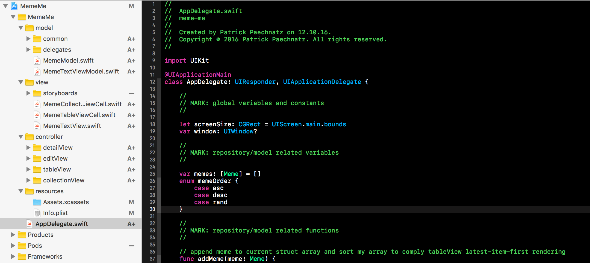
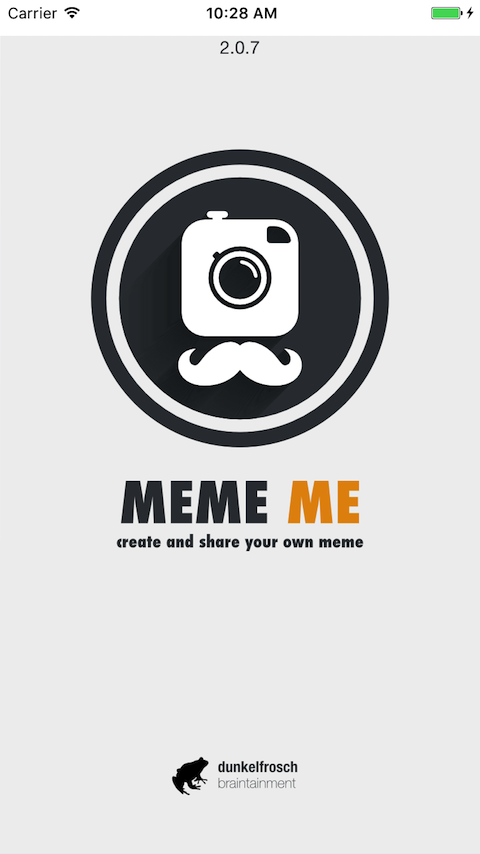
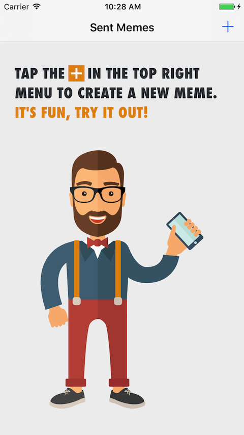
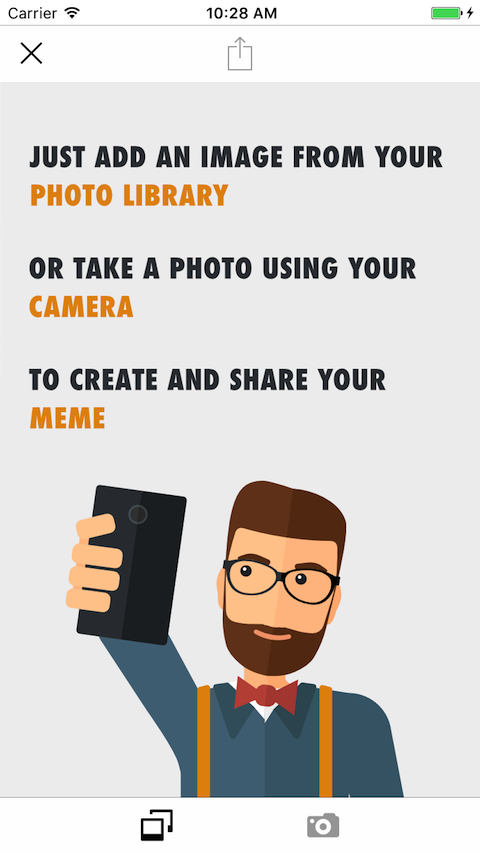
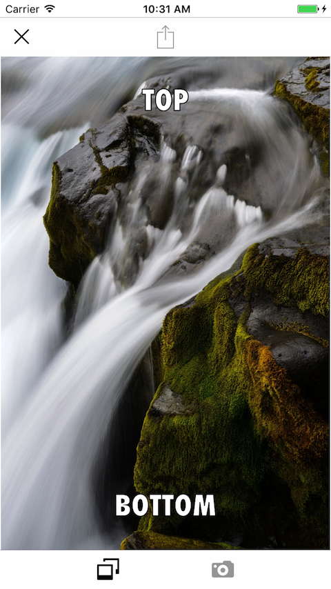
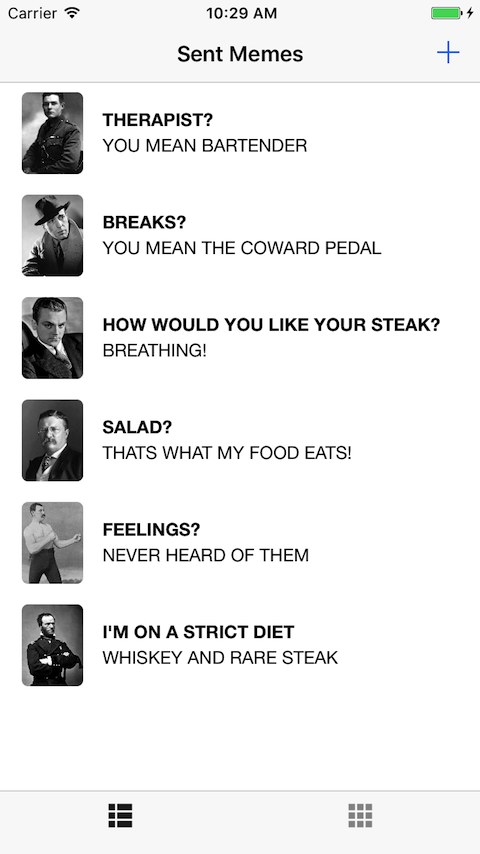
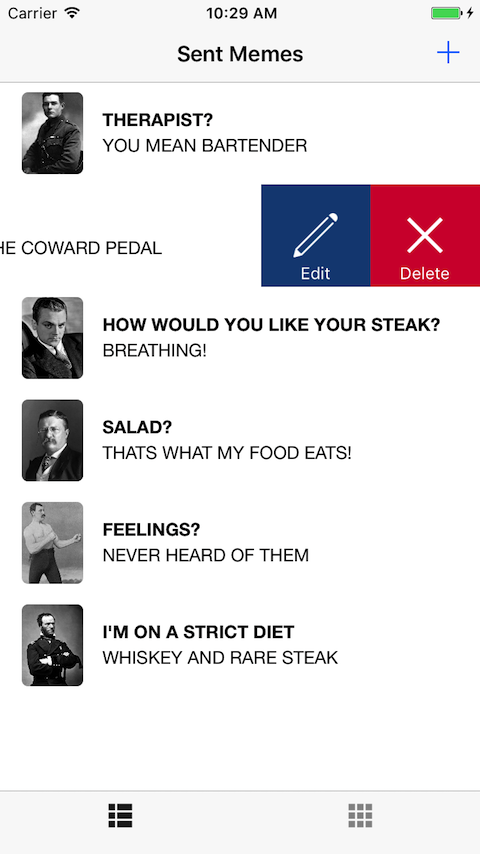

# MEME-ME
## udacity.com student submission

*This repository contains the project submission for udacity.com project work  "MemeMe" (v1/v2) during my iOS developer certification program (course ND003).*

## App Description

With MemeMe you can create multiple persistent memes using your fotos or take one from your camera directly. Meme enables a user to take a picture, and add text at the top and bottom to form a meme. The user will be able to share the photo on Facebook and Twitter and also by SMS or email. Memes will appear in a tab view with two tabs: a table view and a collection view.

## App Specifications

MemeMe master (currently 2.0.7) using the latest XCode 8.3 (8E162) version and will be able to run under iOS version 9.n up to the latest iOS version 10.n. MemeMe uses 3rd Party Libraries for better UX/UI behavior and graphical elements from vectorstock. A complete list of used libraries can be found inside the projects [COPYRIGHT.md](COPYRIGHT.md) file.

## App Features

MemeMe supports a base set of fixture load to bring you a subset of well known memes to play with.

## App Structure

MemeMe is following the MVC pattern by structural and logical definition. The app is using dedicated view partials instead of base sub views of table cells and annotations.

 

### SplashScreen / Initial View

Splash Screen             |  Welcome Screen
:-------------------------:|:-------------------------:
  |  

### Create Meme from Source

Create Meme Screen             |  Edit Meme Screen
:-------------------------:|:-------------------------:
  |  

### ListView / CollectionView

ListView  of all Memes           |  Collection View of Memes
:-------------------------:|:-------------------------:
  |  

### Edit Meme in Row

Edit Meme from Row          |  Meme EditView
:-------------------------:|:-------------------------:
  |  

## Keywords
swift, swift-3, udacity, extension, uikit, foundation, app

## Releases

MemeMe is currently available in [12 releases](https://github.com/paterik/udacity-ios-meme-me/releases) and will be following the Sequence-based version pattern _major.minor[.maintenance[.build]]_. The Build will be auto-generated during each XCode-Build-Prozess using 3rd-Party-Script [xcode-version-bump.sh](https://gist.github.com/sekati/3172554) of Jason Horwitz (sekati). The build number won’t be part of my semantic versioning. 

## Changelog

All notable changes of the MemeMe release series are documented in project [CHANGELOG.md](CHANGELOG.md) file using the [Keep a CHANGELOG](http://keepachangelog.com/) prtheinciples. The changelog documentation starts with version 1.0.0 (2016-10-14). The latest „exam“ version of MemeMe met the specifications to accomplish the course sub goal. 

## License-Term

Copyright (c) 2016-2017 Patrick Paechnatz <patrick.paechnatz@gmail.com>
                                                                           
Permission is hereby granted,  free of charge,  to any  person obtaining a copy of this software and associated documentation files (the "Software"), to deal in the Software without restriction,  including without limitation the rights to use,  copy, modify, merge, publish,  distribute, sublicense, and/or sell copies  of the  Software,  and to permit  persons to whom  the Software is furnished to do so, subject to the following conditions:       
                                                                           
The above copyright notice and this permission notice shall be included in all copies or substantial portions of the Software.
                                                                           
THE SOFTWARE IS PROVIDED "AS IS", WITHOUT WARRANTY OF ANY KIND, EXPRESS OR IMPLIED, INCLUDING  BUT NOT  LIMITED TO THE WARRANTIES OF MERCHANTABILITY, FITNESS FOR A PARTICULAR  PURPOSE AND  NONINFRINGEMENT.  IN NO EVENT SHALL THE AUTHORS OR COPYRIGHT HOLDERS BE LIABLE FOR ANY CLAIM, DAMAGES OR OTHER LIABILITY,  WHETHER IN AN ACTION OF CONTRACT,  TORT OR OTHERWISE,  ARISING FROM,  OUT OF  OR IN CONNECTION  WITH THE  SOFTWARE  OR THE  USE OR  OTHER DEALINGS IN THE SOFTWARE.